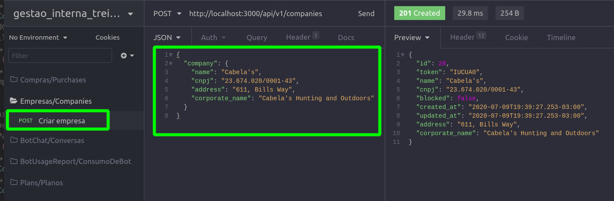
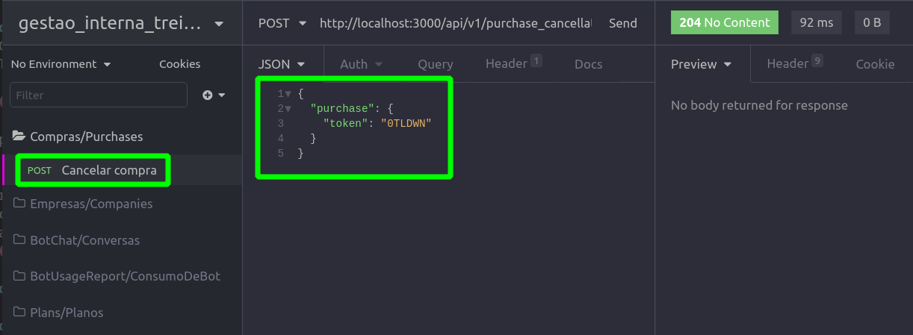
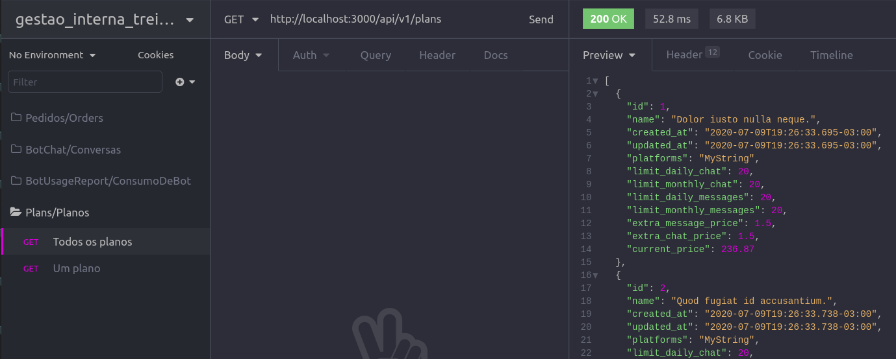
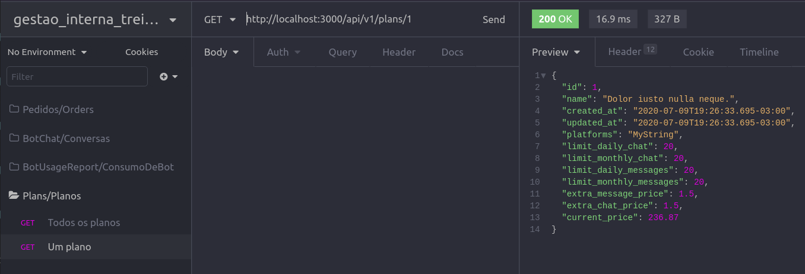
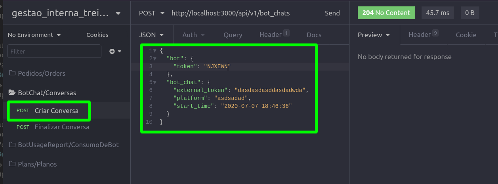
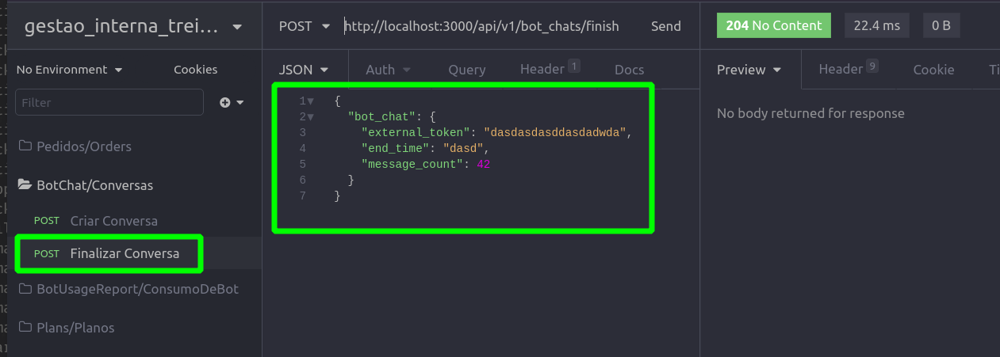
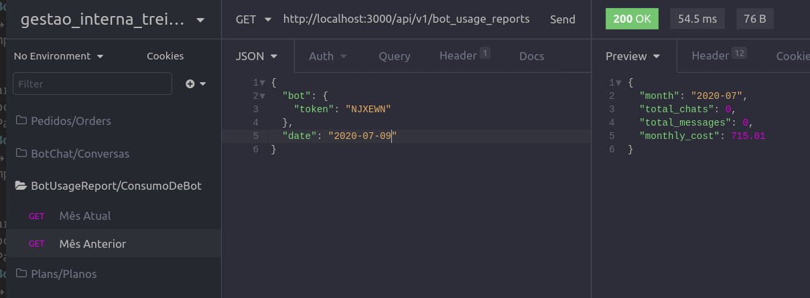

# Sistema de Gestão de Bots

## Tópicos

- :small_blue_diamond: Descrição do projeto
- :small_blue_diamond: Funcionalidades
- :small_blue_diamond: Pré-requisistos
- :small_blue_diamond: [API V1](#api-v1)
  - :small_blue_diamond: [Cadastro de empresas](#cadastro-de-empresas)
  - :small_blue_diamond: [Cancelamento de compra](#cancelamento-de-compra)
  - :small_blue_diamond: [Todos os Planos](#todos-os-planos)
  - :small_blue_diamond: [Um plano por Identificador](#um-plano-por-identificador)
  - :small_blue_diamond: [Iniciar conversa de Bot](#iniciar-conversa-de-bot)
  - :small_blue_diamond: [Encerrar conversa de Bot](#encerrar-conversa-de-bot)
  - :small_blue_diamond: [Consumo de dados dos Bots](#consumo-de-dados-dos-bots)

## API V1

### Cadastro de empresas

#### Descrição

<p align="justify"> A API de cadastro de empresas tem a funcionalidade de ao receber os dados de uma empresa, cadastra-los no nosso sistema e gerar o token para identificações dessa empresa no futuro. Assim que cadastrado os dados são devolvidos adicionando o token gerado.</p>

#### Parametros necessarios

- Model [company]
- Nome da empresa [name]
- Razão social [corporate_name]
- Endereço [address]
- CNPJ [cnpj]
- **Todos os dados devem ser enviados como um JSON**
- **Exemplo:**
  - **{ company: { name: 'TreinaDev', corporate_name: 'CampusCode', address: 'Av. Ṕaulista, 123', cnpj: ' 00.000.000/0000-00' } }**

#### Parametros devolvidos

- Nome da empresa [name]
- Razão social [corporate_name]
- Endereço [address]
- CNPJ [cnpj]
- Código gerado para identificação da empresa [token]
- ID [id]
- **Todos os dados serão enviados como um JSON**

#### Verbo HTTP

- **POST**
- Os dados devem ser enviados para seguinte rota:
  - **/api/v1/companies**

#### Possiveis erros

- Parametros obrigatorios:
  - Nome, Razão social, Endereço, CNPJ. Caso algum parametro estivem em branco a resposta será:
    - [atributo] não pode ficar em branco
  - Erros exclusivos do CNPJ:
    - **já está em uso** - Motivo: CNPJ já cadastrado
    - **não é válido** - Motivo: CNPJ incorreto, ou, fora de formatação
- Company vazio:
  - Mensagem: **param is missing or the value is empty: company**
  - Motivo: **chave company faltando no json { company: { } }**



---

### Cancelamento de Compra

#### Descrição

<p align="justify">A API de cancelamento permite que o cliente solicite o cancelamento de uma compra informando o token e o motivo de cancelamento (opcional). Após o sistema receber a solicitação do cliente, é necessario que um usuario do sistema autorize essa solicitação. Cada compra poderá haver somente uma solicitação de cancelamento em aberto, caso já exista, o sistema retonará um erro.</p>

#### Parametros necessarios

- Model [purchase]
- Token [token]
- Motivo do cancelamento **(OPCIONAL)** [reason]
- **Todos os dados devem ser enviados como um JSON**
- **Exemplo:**
  - **{ purchase: { token: 'ABC123'}, reason: 'String' }**

#### Parametros devolvidos

- Status da comunicação 200
- **Todos os dados serão enviados como um JSON**

#### Verbo HTTP

- **POST**
- Os dados devem ser enviados para seguinte rota:
  - **/api/v1/purchase_cancellations**

#### Possiveis erros

- Token não encontrado:
  - Status de comunicação devolvido será: **404**
- Compra já possui solicitação de cancelamento em aberto:
  - Status de comunicação devolvido será: **400**



---

### Todos os Planos

#### Descrição

<p align="justify">Este endpoint permite a listagem de todos os planos ativos cadastrados no sistema de gestão e seus detalhes.</p>

#### Parametros necessarios

- Não precisa parametros

#### Parametros devolvidos

- Status da comunicação 200
- **Todos os dados serão enviados como um JSON**

#### Verbo HTTP

- Deve ser realizada uma requisição na seguinte rota:
  - **GET /api/v1/plans**
- A rota retorna um array com todos os planos ativos:

```json
[
  {
    "id": 1,
    "name": "quasi",
    "created_at": "2020-07-02T18:55:52.827-03:00",
    "updated_at": "2020-07-02T18:55:52.827-03:00",
    "platforms": "MyString",
    "limit_daily_chat": 1,
    "limit_monthly_chat": 1,
    "limit_daily_messages": 1,
    "limit_monthly_messages": 1,
    "extra_message_price": 1.5,
    "extra_chat_price": 1.5,
    "status": "active",
    "current_price": 595.08
  },
  {
    "id": 2,
    "name": "vel",
    "created_at": "2020-07-02T18:55:52.869-03:00",
    "updated_at": "2020-07-02T18:55:52.869-03:00",
    "platforms": "MyString",
    "limit_daily_chat": 1,
    "limit_monthly_chat": 1,
    "limit_daily_messages": 1,
    "limit_monthly_messages": 1,
    "extra_message_price": 1.5,
    "extra_chat_price": 1.5,
    "status": "active",
    "current_price": 775.65
  }
]
```



---

### Um plano por Identificador

#### Descrição

<p align="justify">Este endpoint permite ver os detalhes de um plano em particular pelo seu Identificador.</p>

#### Parametros necessarios

- O identificador do plano na rota.
- Exemplo: **/api/v1/plans/42**

#### Parametros devolvidos

- Status da comunicação 200
- **Todos os dados serão enviados como um JSON**

#### Verbo HTTP

- Deve ser realizada uma requisição na seguinte rota:
  - **GET /api/v1/plans/42**
- A rota retorna um array com os dados do plano:

```json
{
  "id": 42,
  "name": "quasi",
  "created_at": "2020-07-02T18:55:52.827-03:00",
  "updated_at": "2020-07-02T18:55:52.827-03:00",
  "platforms": "MyString",
  "limit_daily_chat": 1,
  "limit_monthly_chat": 1,
  "limit_daily_messages": 1,
  "limit_monthly_messages": 1,
  "extra_message_price": 1.5,
  "extra_chat_price": 1.5,
  "status": "active",
  "current_price": 595.08
}
```

#### Possiveis erros

- Plano não encontrado:
  - Status de comunicação devolvido será: **404**



---

### Iniciar conversa de Bot

#### Descrição

<p align="justify">A API de conversa de Bot permite registrar o início de uma conversa que o bot fez com um cliente.</p>

#### Parametros necessarios

- Token do Bot no nosso sistema [bot][token]
- Identificador da conversa no sistema externo [bot_chat][external_token]
- Plataforma onde ocorreu a conversa [bot_chat][platform]
- Tempo de início da conversa [bot_chat][start_time]
- **Todos os dados devem ser enviados como um JSON**
- **Exemplo:**

```json
{
  "bot": {
    "token": "M5KJHU"
  },
  "bot_chat": {
    "external_token": "skdpofmp3201qjoifjpkp",
    "platform": "Whatsapp",
    "start_time": "2020-07-07 18:46:36"
  }
}
```

#### Verbo HTTP

- **POST**
- Os dados devem ser enviados para seguinte rota:
  - **/api/v1/bot_chats**

#### Parametros devolvidos

- Status da comunicação 200
- **Todos os dados serão enviados como um JSON**

#### Possiveis erros

- Bot não encontrado por Token:
  - Status de comunicação devolvido será: **404**
- Já existe uma conversa de bot cadastrada com o mesmo identificador externo:
  - Status de comunicação devolvido será: **422**



---

### Encerrar conversa de Bot

#### Descrição

<p align="justify">Complementando a API de conversa de Bot, criamos uma action que recebe os dados da conversa e quantidade de mensagens, assim encerrando uma conversa do bot e cadastrando todos os dados para controle do sistema. </p>

#### Parametros necessarios

- Identificador da conversa no sistema externo [bot_chat][external_token]
- Tempo que a conversa foi encerrada [bot_chat][end_time]
- Quantidade de mensagens trocadas [bot_chat][message_count]
- **Todos os dados devem ser enviados como um JSON**
- **Exemplo:**

```json
{
  "bot_chat": {
    "external_token": "dasd",
    "end_time": "2020-07-07 19:46:36",
    "message_count": 42
  }
}
```

#### Verbo HTTP

- **POST**
- Os dados devem ser enviados para seguinte rota:
  - **/api/v1/bot_chats/finish**

#### Parametros devolvidos

- Status da comunicação 200
- **Todos os dados serão enviados como um JSON**

#### Possiveis erros

- Status de comunicação devolvido será: **404**

  - Conversa não encontrada por Token

- Status de comunicação devolvido será: **422**
  - Tempo de termino(end_time) ocorreu antes do tempo de inicio da conversa(start_time)



---

### Consumo de dados dos Bots

#### Descrição

<p align="justify"> Esta API devolve os dados referentes as trocas de mensagens dos bots contrados pelos clientes. A requisição desses dados pode ser feita para o mês atual, ou para um mês anterior passando a data desejada nos parametros JSON.</p>

#### Parametros necessarios

- Token do bot [bot][token]
- Data do mês desejado **OPCIONAL** [date] **(somente necessário caso a requisição não seja referente ao mês atual)**
- **Todos os dados devem ser enviados como um JSON**
- **Exemplo JSON para o mês atual:**
  - **{ bot: { token: 'ABC123'} }**
- **Exemplo JSON para um mês anterior:**
  - **{ bot: { token: 'ABC123'}, date: '2019-07-09' }**

#### Parametros devolvidos

- Mês consultado [month]
- Quantidade de conversas no mês consultado [total_chats]
- Quantidade de mensagens no mês consultado [total_messages]
- Valor previsto para ser cobrado no mês consultado [monthly_cost]
- **Todos os dados serão enviados como um JSON**

#### Verbo HTTP

- **GET**
- É necessário um GET na seguinte rota:
  - **/api/v1/bot_usage**

#### Possiveis erros

- Status de comunicação devolvido será: **404**
  - Bot não encontrada por Token

- Status de comunicação devolvido será: **422**
  - Data enviada possuir formato invalido
  - Data enviada for anterior a data de criação do bot(data de confirmação de compra)




---
